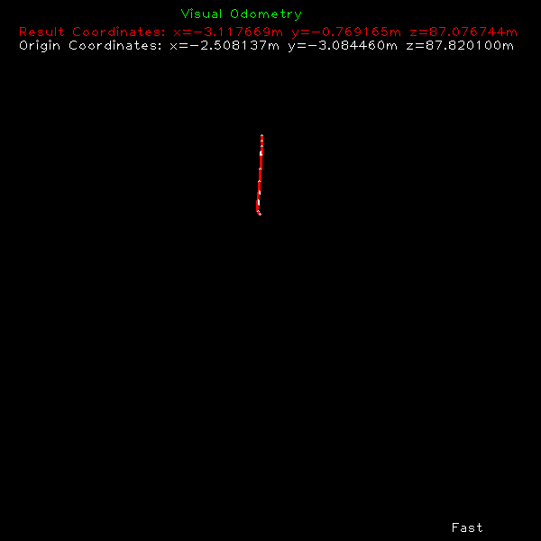

**Keywords:** FAST Feature Detection, LK Feature Tracking, Five-Point Motion Estimation

## Mono Visual Odometry
Writen: Aji

### Requirements
* Python 3
* Numpy
* OpenCV
* Moildev == 2.6

### Dataset
This program can proses dataset from kitti or from fisheye
 [KITTI odometry data set (grayscale, 22 GB)](http://www.cvlibs.net/datasets/kitti/eval_odometry.php)

 for fish eye image you can click [MOIL dataset](https://mcut-my.sharepoint.com/:f:/r/personal/m07158025_o365_mcut_edu_tw/Documents/MOIL-dataset?csf=1&web=1&e=5zFEHN)
### Usage
**Modify the path** in main.py to your image sequences and ground truth trajectories, then run

```
python main.py
```



### References
1. [一个简单的视觉里程计实现 | 冯兵的博客](http://fengbing.net/2015/07/26/%E4%B8%80%E4%B8%AA%E7%AE%80%E5%8D%95%E7%9A%84%E8%A7%86%E8%A7%89%E9%87%8C%E7%A8%8B%E8%AE%A1%E5%AE%9E%E7%8E%B01/ )<br>
2. [Monocular Visual Odometry using OpenCV](http://avisingh599.github.io/vision/monocular-vo/) and its related project report [_Monocular Visual Odometry_](http://avisingh599.github.io/assets/ugp2-report.pdf) | Avi Singh
3. [first edit](https://github.com/yueying/LearningVO)
4. [second edit](https://github.com/uoip/monoVO-python)
5. [reference fisheye](https://github.com/MoilOrg/odometry/tree/main)

Search "cv2.findEssentialMat", "cv2.recoverPose" etc. in github, you'll find more python projects on slam / visual odometry / 3d reconstruction
